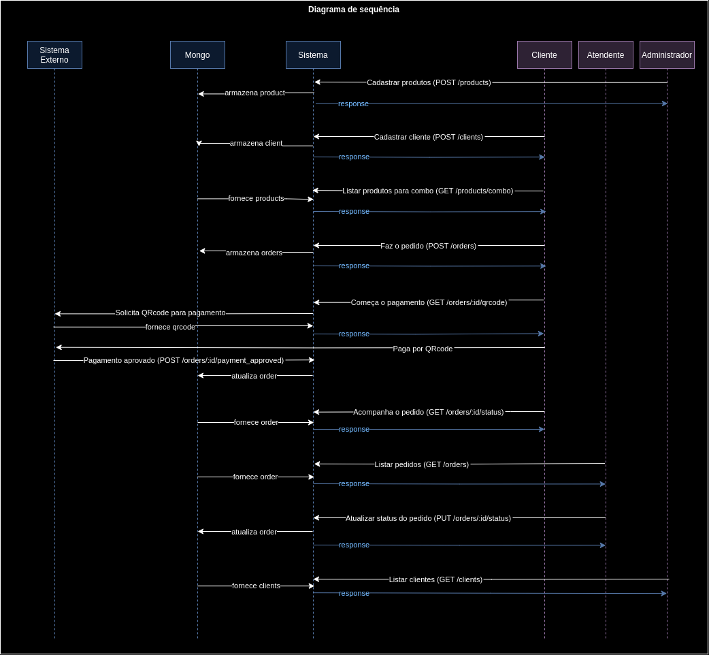
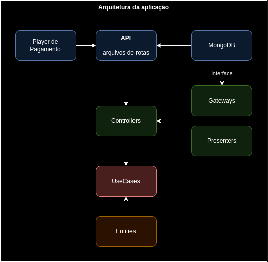
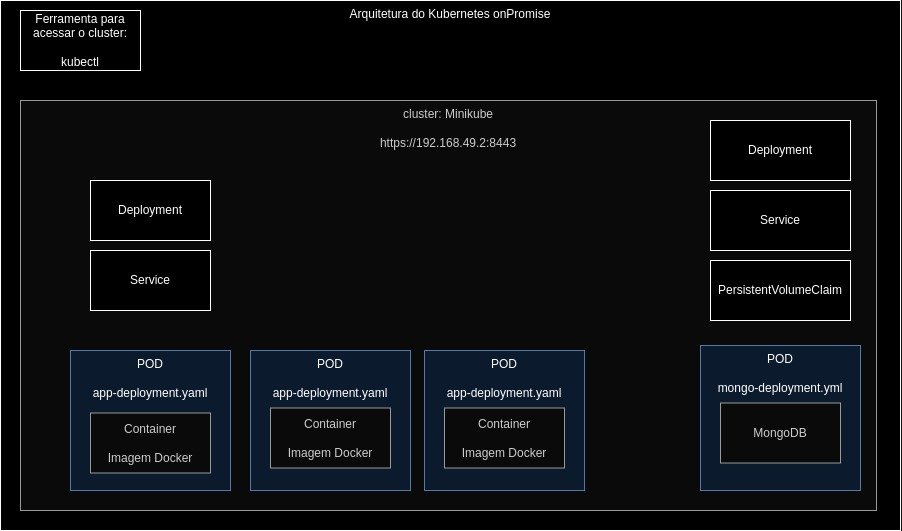

# postech-fase2-fastfood

API com Clean Architecture


## Setup

Você vai precisar do
Node.js v18.10.0 com o nvm 0.39.0
Possui as dependências: Express, Mongoose, Dotenv e Body-parser.

### local

```bash
nvm use v18.10.0 && npm run start
```

### ou com Docker

Você precisa ter instalado o Docker com Docker compose.
Irá subir 2 containers, o do mongo e do API.

```bash
docker compose up
```

## Utilização

1. O administrador inicia o estoque
   * Cadastrar produtos com uma das 4 categorias: Lanche, Bebida, Acompanhamento ou Sobremesa.
     * POST /products
2. Chegada do cliente
   * Cadastrar o cliente com o CPF, nome e email
     * POST /clients
   * Listar os produtos para o combo (lanche, bebida e acompanhamento)
     * GET /products/combo
3. O client faz o pedido
   * Inserir um pedido com os produtos e quantidades 
     * POST /orders
4. O client faz o pagamento
   * Gerar o QRcode
     * GET /orders/:id/qrcode
   * O pagamento pode ser aprovado pelo sistema externo
     * POST /orders/:id/payment_approved
5. O cliente acompanha o pedido 
   * Mostrar status do pedido
     * GET /orders/:id/status
6. O atendente atualiza o status do pedido
    * Listar os pedidos a serem feitos pela cozinha
      * GET /orders
    * Atualizar status do pedido
     * PUT /orders/:id/status
7. O administrador lista os clientes para campanhas promocionais
    * Listar clientes
      * GET /clients

### Diagrama de Sequência



### Consultar swagger

* Com a aplicação rodando, acesse
  * [http://localhost:3000/api-docs](http://localhost:3000/api-docs)
* Arquivo direto pela sua IDE
  * [./src/docs/swagger/swagger.json](src/docs/swagger/swagger.json)

## Como que o sistema funciona?

Ele foi feito com Clean Architecture, então o sistema está preparado para troca de integrações.

Estrutura de diretórios da camada mais externa para a mais interna.

- API: Possui as rotas da API no padrão rest, estão subdivididas por usecase.
- Integrations: possui a conexão do mongo e dos seus databases.
- Gateways: possui o a interface para as conexões com os banco de dados e o padrão que será passado para o usecase. 
- Controllers: Passa as conexões externas para o usecase. 
- Presenters: possui as classes de saída de dados. 
- Usecases: possui as operações a serem realizadas pelo sistema.
- Entities: São as classes core do negócio.

### Arquitetura da aplicação




## Deploy com Kubernetes

Para um ambiente Ubuntu 22.04, 
você precisa do docker (26.1.4, build 5650f9b), kubectl (v5.0.1) e minikube (v1.33.1).

1. gera imagem para o docker local
```bash
eval $(minikube docker-env)
docker build -t postech-fase2-fastfood-api:latest .
```

2. configuração do minikube
```bash
minikube start
minikube status
kubectl config use-context minikube
kubectl cluster-info
```
3. configurar o k8s
```bash
kubectl apply -f k8s/mongo-deployment.yaml
kubectl apply -f k8s/mongo-service.yaml
kubectl apply -f k8s/app-deployment.yaml
kubectl apply -f k8s/app-service.yaml
```

4. acompanhar o ambiente
```bash
kubectl get all
minikube service app-service
```
ou em separado

```bash
kubectl get deployments
kubectl get pods
kubectl get services
kubectl get replicasets
```

5. pegar o endereço da aplicação
```bash
minikube service app-service --url
```

6. parar o ambiente
```bash
minikube stop
docker stop registry
docker rm registry
```

### Arquitetura da aplicação



## Contribuições

O projeto utiliza convention commit.

---

Desenvolvido com :) por uma dev!
